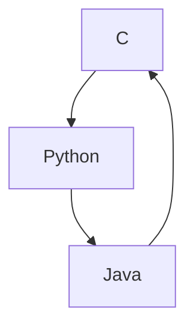

### System.out.println("Olá, bem-vindo(a)!"); 👋

_-->Estudante de Engenharia de Computação_

_-->Bolsista voluntária de Iniciação Científica e de Extensão em Astronomia🔭_

_-->Atuante em Iniciação Científica e de Extensão a robótica movel ⚡_

__`Conhecimentos sendo aprimorados em:`__

